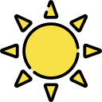
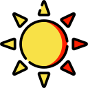
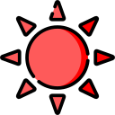

# 🌡️ Jeedom Canicule

> Scénario Jeedom de surveillance et alertes progressives de canicule

[](https://www.jeedom.com)
[](https://www.raspberrypi.com)
[](https://telegram.org)

---

## 🎯 Objectif

Ce scénario surveille la température extérieure chaque soir et déclenche des alertes progressives par Telegram en cas de canicule.

Il se base sur la définition météorologique française de la canicule :
- Température **maximale ≥ 30°C**
- Température **minimale ≥ 20°C** (nuit tropicale)

Le compteur s'incrémente chaque jour où ces deux critères sont remplis simultanément, et se remet à zéro dès qu'une journée ne les remplit pas.

---

## 🚨 Niveaux d'alerte

| Compteur | Niveau | Message Telegram |
|---|---|---|
| 1 jour | 🌡️ Niveau 1 | Canicule à venir — chaleur annoncée |
| 2 jours | 🌡️🌡️ Niveau 2 | 2 jours consécutifs — vigilance |
| ≥ 3 jours | 🚨 Niveau 3 | ALERTE CANICULE — hydratation urgente |
| 0 (retour) | ✅ Fin | Retour à la normale |

Une notification n'est envoyée que si le **niveau change** — pas de spam si la canicule persiste au même niveau.

---

## 📁 Structure du repo

```
jeedom-canicule/
├── README.md
├── assets/
│   └── img/
│       ├── Sun0.png      ← Niveau 0 — pas de canicule
│       ├── sun033.png    ← Niveau 1 — vigilance
│       ├── sun066.png    ← Niveau 2 — alerte
│       └── sun100.png    ← Niveau 3 — canicule confirmée
└── scenario/
    └── canicule.php      ← Bloc code PHP à coller dans Jeedom
```

---

## ⚙️ Installation

### Prérequis
- Jeedom 4.x sur Raspberry Pi
- Une sonde température extérieure historisée
- Plugin Telegram configuré

### Déploiement

1. Dans Jeedom → **Scénarios → Nouveau scénario**
2. Ajouter un **bloc code** PHP
3. Coller le contenu de `scenario/canicule.php`
4. Adapter les IDs des commandes (voir section Configuration)
5. Configurer le déclencheur cron

### Déclencheur recommandé

```
30 23 * * *
```

Chaque soir à 23h30 — permet d'avoir le max et le min complet de la journée.

---

## 🔧 Configuration

Deux valeurs à adapter dans le code :

```php
// ID de la commande température extérieure
$q->bindValue(':cmd_id', XXXX, PDO::PARAM_INT); // ← ID température

// ID de la commande Bot Telegram
cmd::byId(YYYY)->execCmd([...]); // ← ID Bot Telegram
```

Pour trouver les IDs dans Jeedom :

```bash
mysql -u jeedom -p jeedom -e "SELECT id, name FROM cmd WHERE eqLogic_id IN (SELECT id FROM eqLogic WHERE name LIKE '%température%') ORDER BY name;"
```

### IDs utilisés dans ce projet

| Commande | ID |
|---|---|
| Température extérieure (Margny) | `6233` |
| Bot Telegram (Alweddle) | `6039` |

---

## 📊 Variables Jeedom

| Variable | Rôle |
|---|---|
| `Compteur_Canicule` | Nombre de jours consécutifs de canicule |
| `canicule` | Niveau d'alerte actuel (0, 1, 2 ou 3) |

Ces variables peuvent être utilisées dans un widget Jeedom pour afficher le niveau en temps réel sur le dashboard.

---

## 🎨 Widget dashboard

Le widget utilise le template Jeedom **`tmplmultistate`** — il affiche une image de soleil différente selon le niveau de canicule.

### Aperçu

| Niveau | Image | Description |
|---|---|---|
| 0 |  | Pas de canicule |
| 1 |  | Vigilance |
| 2 |  | Alerte niveau 2 |
| 3 |  | Canicule confirmée |

### Configuration du widget

```json
{
  "name": "Canicule",
  "type": "info",
  "subtype": "numeric",
  "template": "tmplmultistate",
  "test": [
    {
      "operation": "#value#==0",
      "state_light": "",
      "state_dark":  ""
    },
    {
      "operation": "#value#==1",
      "state_light": "",
      "state_dark":  ""
    },
    {
      "operation": "#value#==2",
      "state_light": "",
      "state_dark":  ""
    },
    {
      "operation": "#value#==3",
      "state_light": "",
      "state_dark":  ""
    }
  ]
}
```

### ⚠️ Important — Emplacement des images

Les images du repo `assets/img/` sont fournies **à titre de documentation uniquement**.

Pour que le widget fonctionne dans Jeedom, les images doivent être copiées sur le Raspberry Pi dans :

```
/var/www/html/data/img/Maison/Exterieur/
```

---

## 📝 Changelog

| Date | Version | Changements |
|---|---|---|
| Mai 2026 | v1.0 | Création du scénario en PHP + widget |

---

## 🔗 Liens

- ☀️ [Repo Solar Dashboard](https://github.com/Alweddle/solar-dashboard)
- 💻 [CV interactif](https://alweddle.github.io)
